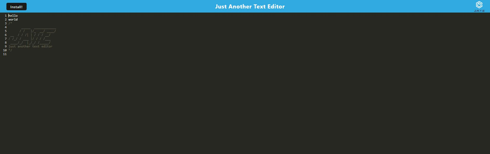

# Text Editor Web Application

## Description

This is a web-based text editor application that offers offline capabilities and is installable as a Progressive Web App (PWA). The application utilizes modern JavaScript, Webpack for bundling, IndexedDB for local storage, and Workbox for service worker management. 

## Features

- Client-server architecture
- Bundled JavaScript files using Webpack
- Auto-generated HTML, service worker, and manifest files via Webpack plugins
- IndexedDB for offline data storage
- PWA installability
- Service worker for asset caching and offline functionality

## Screenshot
 - Main Page


## Installation

1. Clone the repository:
   ```bash
   git clone https://github.com/AlexCapilla/text-editor.git
   cd text-editor

2. Install dependencies:
    npm install


## Usage

### Starting the Application
To start the application, run the following command from the root directory:
npm run start
This will start the backend server and serve the client.

## Development
For development, you can use the following command to start the application with live reloading:
npm run dev

## Webpack Bundling
The JavaScript files are bundled using Webpack. The application is configured to use Webpack plugins to generate an HTML file, a service worker, and a manifest file.

## IndexedDB
Upon opening the text editor, an IndexedDB database is immediately created for storing content. Content entered in the text editor is saved automatically when you click off the DOM window and retrieved upon reopening the application.

## Service Worker and PWA
The application registers a service worker using Workbox. The service worker pre-caches static assets and ensures the application works offline. You can install the application as a PWA by clicking the "Install" button.

## Deployment
To deploy the application to Render, ensure you have the proper build scripts in place for a Webpack application. The application should automatically build and start on Render.

## License
This project is licensed under the MIT License.